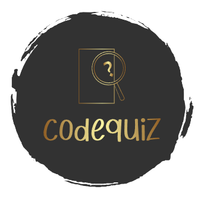

# Code Quiz

## Description

 i wanted to assist other new devolopers in their coding knowlegde so i built this project to test a persons knowledge on coding.

## Table of Contents
*[Title](#title)

*[Description](#description)
    
*[Installation](#installation)
    
*[Usage](#usage)
    
*[License](#license)
    
    
*[Questions](#questions)

*[URL](#URL)
    

## Installation

open Html in your web browser

## Usage

this quiz can help a person learn through on th espot thinking due the the time punishment aspect of the test.

## License

## badges

             
             

## Questions
Any questions about this project please send me a message on *https://github.com/fordefam12 or email me at [fordefam12@gmail.com]

## URL
  

<a href='https://fordefam12.github.io/code-quiz/'>
CLICK QR CODE for deploy link
// </a>

## Screenshots

.png>)